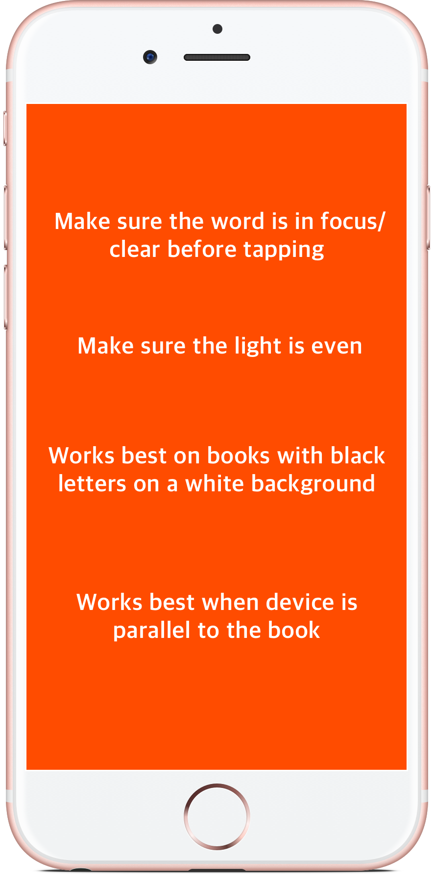
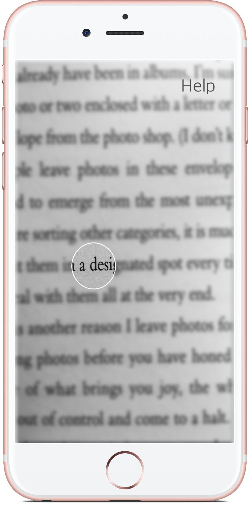
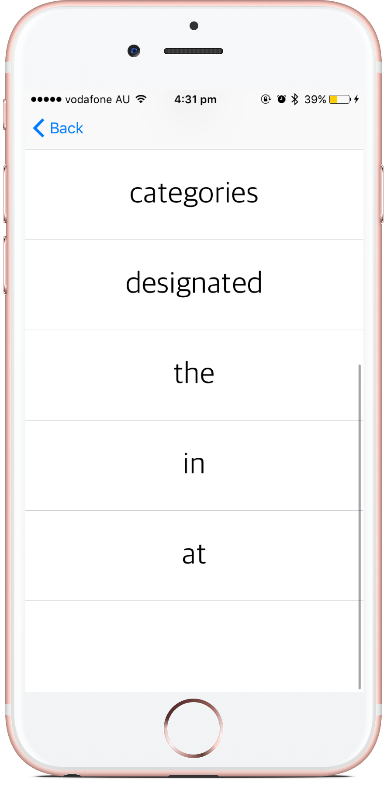
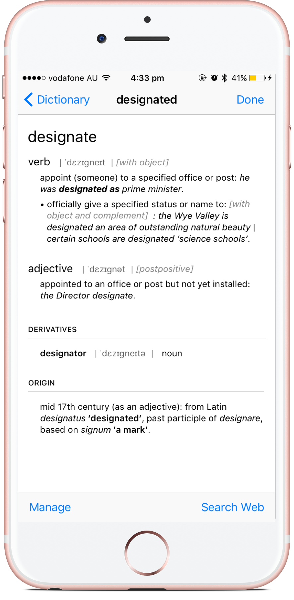

# Lookie

An OCR iOS app to make finding word definitions easier when reading a physical book.

   
#### Frameworks Used
- [Open CV](https://docs.opencv.org/2.4/doc/tutorials/ios/table_of_content_ios/table_of_content_ios.html)
- [Tesseract OCR iOS](https://github.com/gali8/Tesseract-OCR-iOS)

#### Pipeline Used

Crop image around user touch ----> Process image using OpenCV -----> Tesseract OCR ------> List of words detected

#### Links

- [Website](http://lookieapp.weebly.com)
- [App Store](https://itunes.apple.com/us/app/lookie-dictionary-made-easy/id1219869272?ls=1&mt=8)

